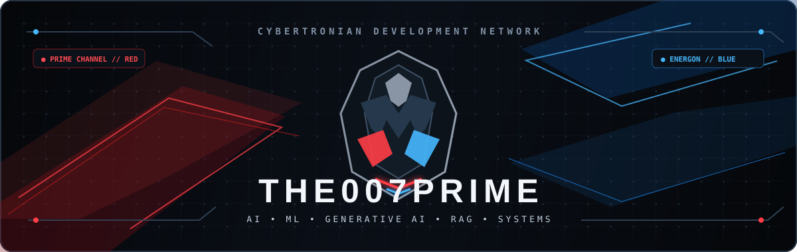
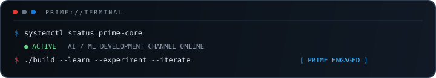

<div align="center">



<br/>


<br/>

# `THE007`

### AI / ML ENTHUSIAST

**Machine Learning • Generative AI • RAG • LLMs • Linux**

Building practical AI systems with a focus on fundamentals, reliability, and understanding how things work.

<br/>

<a href="https://github.com/the007prime">
  
</a>
<a href="https://github.com/the007prime?tab=repositories">
  
</a>

</div>

---

## About

I'm an aspiring **AI / ML Engineer** focused on building a strong foundation across machine learning, deep learning, generative AI, and AI engineering.

My current focus:

- Machine learning fundamentals and model evaluation
- Transformers, LLMs, and embeddings
- RAG and information retrieval
- Fine-tuning with PEFT / LoRA / QLoRA
- Local and offline AI systems
- Linux, containers, and developer tooling

I value **understanding over abstraction** — learning the underlying concepts, then turning them into working software.

---

## Projects

<table>
<tr>

<td width="33%" valign="top">

### `airgap-rag`

**Offline RAG system**

Local-first retrieval with:

- BM25 + vector search
- ChromaDB
- Cross-encoder reranking
- Ollama
- No external model API dependency

<a href="https://github.com/the007prime/airgap-rag">View project →</a>

</td>

<td width="33%" valign="top">

### `ChurnPulse-ANN`

**Customer churn ML**

An end-to-end benchmark covering:

- XGBoost
- Neural networks
- TreeSHAP
- Model evaluation

<a href="https://github.com/the007prime/ChurnPulse-ANN">View project →</a>

</td>

<td width="33%" valign="top">

### `market_pridiction`

**Market analysis**

A prediction dashboard built with:

- TensorFlow / LSTM
- Streamlit
- yfinance
- Technical indicators
- Historical analysis

<a href="https://github.com/the007prime/market_pridiction">View project →</a>

</td>

</tr>
</table>

---

## Stack

<div align="center">


<br/><br/>

`Python` `PyTorch` `scikit-learn` `Transformers` `RAG` `Ollama`  
`Git` `GitHub` `Linux` `Docker` `Podman`

</div>

---

## GitHub Activity

<div align="center">


</div>

---

## Current Focus

```text
Machine Learning
      ↓
Deep Learning
      ↓
Transformers & LLMs
      ↓
RAG & Retrieval
      ↓
Fine-tuning
      ↓
AI Engineering
```

---

## Engineering Approach

> **Understand the system. Build it. Measure it. Improve it.**

I prefer small, working systems over unnecessary complexity — with an emphasis on fundamentals, experimentation, and clean implementation.

---

<div align="center">



<br/><br/>

**Learning • Building • Iterating**

</div>
