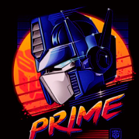
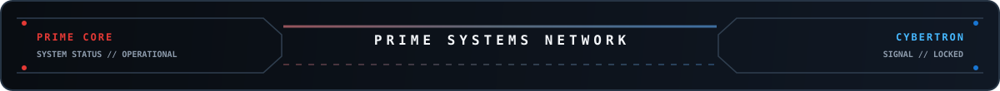

<div align="center">


<br/>


<br/>



# `THE007PRIME`

### `PRIME SYSTEM // ONLINE`

**AI / ML ENGINEER IN PROGRESS**  
**MACHINE LEARNING • GENERATIVE AI • RAG • LLMs • LINUX**

> *Learn the machinery. Build the system. Understand the why.*

<br/>

<a href="https://github.com/the007prime">
  
</a>
<a href="https://github.com/the007prime?tab=repositories">
  
</a>

</div>

---



## ⚡ PRIME DIRECTIVE

I'm an aspiring **AI / ML Engineer** focused on understanding intelligent systems from the fundamentals upward.

My approach is simple:

```text
MATHEMATICS
     ↓
MACHINE LEARNING
     ↓
DEEP LEARNING
     ↓
TRANSFORMERS + LLMs
     ↓
RAG + INFORMATION RETRIEVAL
     ↓
LLM FINE-TUNING
     ↓
AI ENGINEERING
```

I prefer building real systems over collecting frameworks.  
The goal is to understand what is happening **under the hood**, then turn that understanding into working software.

---

## 🔴 PRIME MISSION

<table>
<tr>
<td width="50%" valign="top">

### 🧠 MACHINE LEARNING

- Data preprocessing
- Feature engineering
- Dimensionality reduction
- Regression & classification
- Gradient-based optimization
- Model evaluation
- ML mathematics & intuition

</td>
<td width="50%" valign="top">

### 🤖 GENERATIVE AI

- Transformers
- Attention mechanisms
- Embeddings
- Retrieval Augmented Generation
- Hybrid search
- Reranking
- Local LLM inference
- PEFT / LoRA / QLoRA
- Fine-tuning

</td>
</tr>
</table>

---

## ⚙️ TECH ARSENAL

<div align="center">

### Languages & Core


### AI / ML


### Engineering


</div>

<br/>

<div align="center">

`Python` `PyTorch` `scikit-learn` `Transformers` `RAG` `Ollama`
`Git` `GitHub` `Linux` `Docker` `Podman`

</div>

---


## 🔧 PRIME BUILDS

<table>
<tr>
<td width="33%" valign="top">

### `AIRGAP-RAG`

**Sovereign RAG**

Fully offline retrieval system using local inference with:

- Hybrid BM25 + vector search
- ChromaDB
- Cross-encoder reranking
- Ollama
- No external model API dependency

<a href="https://github.com/the007prime/airgap-rag">`OPEN SYSTEM →`</a>

</td>
<td width="33%" valign="top">

### `CHURNPULSE-ANN`

**ML Benchmarking**

End-to-end customer churn prediction system comparing:

- XGBoost
- Neural networks
- TreeSHAP explainability
- Model performance

<a href="https://github.com/the007prime/ChurnPulse-ANN">`OPEN SYSTEM →`</a>

</td>
<td width="33%" valign="top">

### `MARKET_PRIDICTION`

**Deep Learning**

Market analysis and prediction dashboard built around:

- Streamlit
- TensorFlow / LSTM
- yfinance
- Technical indicators
- Historical market analysis

<a href="https://github.com/the007prime/market_pridiction">`OPEN SYSTEM →`</a>

</td>
</tr>
</table>

---

## 🛰️ CURRENT DEVELOPMENT VECTOR

```text
                        ┌──────────────────────┐
                        │       PRIME CORE      │
                        │  AI / ML ENGINEERING  │
                        └──────────┬───────────┘
                                   │
            ┌──────────────────────┼──────────────────────┐
            ↓                      ↓                      ↓
      ┌───────────┐          ┌────────────┐         ┌────────────┐
      │    ML     │          │ GENERATIVE │         │   SYSTEMS  │
      │ FUNDAMENT │          │     AI     │         │ ENGINEERING │
      └─────┬─────┘          └─────┬──────┘         └─────┬──────┘
            │                      │                      │
            ↓                      ↓                      ↓
      Mathematics             RAG / LLMs              Linux
      Algorithms              Fine-tuning              Git
      Optimization            Embeddings               Containers
      Evaluation              Local inference          Tooling
```

---

## 📡 GITHUB TELEMETRY

<div align="center">


<br/>


</div>

---

## 🧩 CONTRIBUTION GRID

<div align="center">


</div>

---


## 🔴 RED CHANNEL // BUILD

```text
BUILD
 ├─ Machine Learning
 ├─ Deep Learning
 ├─ Generative AI
 ├─ RAG Systems
 ├─ LLM Fine-tuning
 └─ AI Engineering
```

## 🔵 BLUE CHANNEL // EXPLORE

```text
EXPLORE
 ├─ Model architectures
 ├─ Information retrieval
 ├─ Local-first AI
 ├─ Systems programming
 ├─ Linux tooling
 └─ Open-source engineering
```

---

## 🧠 ENGINEERING PRINCIPLE

> **Don't just use the model. Understand the model.**

```text
QUESTION
   ↓
UNDERSTAND
   ↓
IMPLEMENT
   ↓
BREAK
   ↓
DEBUG
   ↓
MEASURE
   ↓
IMPROVE
```

---

## 📟 TRANSMISSION CHANNELS

<div align="center">

<a href="https://github.com/the007prime">

</a>
<a href="https://github.com/the007prime?tab=repositories">

</a>

</div>

<br/>

<div align="center">


<br/><br/>

**`THE007PRIME // AUTONOMOUS DEVELOPMENT UNIT`**

*Learning. Building. Iterating.*

</div>
